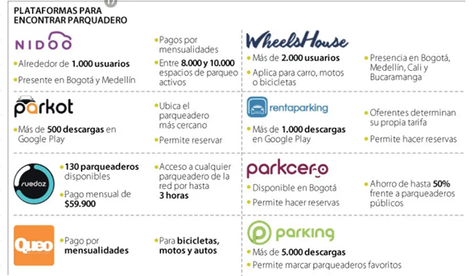

# RioParking.

## Integrantes: 
- Valeria Mejía Mejía 
- Ánderson Olarte Martinez

## 1.Introducción.
Hoy en día vivimos en una sociedad con un ritmo de vida cada vez más acelerado, y las nuevas tecnologías son gran causante de esto. Las nuevas tecnologías han propiciado un escenario ideal donde cada una de las respuestas a nuestras necesidades convergen y se encuentran a la orden de la mano. Tenemos una amalgama de servicios y ofertas en nuestra palma que van desde servicios hospitalarios hasta restaurantes y centros de recreación. En este contexto, es cuestión de tiempo que servicios faltantes se unan al fenómeno de la revolución TIC, ingresando a este sector con las múltiples opciones que nos brinda, que van desde servicios web hasta Apps móviles. En este orden de ideas, actividades tan cotidianas como llegar a un lugar y buscar un parqueadero, pronto migrarán al mundo digital.
## Tema.
Página web para servicios de parqueo.
## Planteamiento del problema.
La urbanización y la sobrepoblación de las ciudades trae consigo retos que debemos hacer frente y con ello buscar soluciones. Uno de estos, es la dificultad que resulta a la hora de buscar un parqueadero adecuado. Muchas veces no conocemos la ubicación exacta de alguno que se encuentre cerca de nuestro lugar de destino o los servicios requeridos, como pueden ser celda con techo, servicio de lavado, servicio de locker, celdas para motocicletas o bicicletas, entre otros. Esto genera que muchas veces desperdiciemos tiempo ingresando a un parqueadero no adecuado, o que no encontremos celdas disponibles.  
## Mockup
<https://marvelapp.com/prototype/1407aijj>

## 5.Estado del arte.
Movilizarse diariamente de un lugar a otro es una actividad hoy en día indispensable para la mayor parte de la sociedad actual, ya sean desplazamientos con el fin de llegar a nuestro lugar de trabajo, estudio, nuestro hogar, etc. Todos tenemos la necesidad de desplazarnos. En Colombia, muchas de las principales ciudades sufren de la ineficiencia de sus sistemas de transporte público, ya sea por su falta de cobertura, horarios no apropiados o por la inseguridad que este puede generar. por estas razonesm los ciudadanos prefieren movilizaes en transporte particular que pueda subsanar los anteriores inconvenientes. Sin embargo, esto trae desventajas, ya que puede provocar un gran número de vehículos rodando en las calles creando grandes volúmenes de tráfico y saturación de ciertos servicios como los parqueaderos.

En Colombia han surgido diferentes soluciones que han tenido como fin conectar a personas que tienen parqueaderos desocupados con quienes lo necesitan como las siguientes.  
  

imagen obtenida de <https://www.larepublica.co/internet-economy/aplicaciones-para-encontrar-donde-parquear-su-carro-y-ofrecer-su-garaje-2905440>  

 entre las principales encontramos a Nidoo, una pap que opera en las dos principales ciudades de Colombia y entre sus principales caracteristicas nos permite encontrar parqueaderos no solo oficiales, sino también de personas que cuenten con un espacio privado y quieran ofrecerlo como lugar de parqueo aumentando ampliamente la oferta de lugares. Tambíen tenemos a Ruedaz, una aplicación donde puedes encontrar amplia variedad y se caracteriza por presentar la oferta de ingresar gratis hasta por tres horas a los parqueaderos de la red si te encuentras pagando una mensualidad en otros. su principal desventaja es que el pago de la mensualidad es fijo y evita que esta propiedad pueda influir a la hora de elegir el lugar de parqueo. Por otro lado está Parkot, donde su principal ventaja es la de poder ubicar el parqueadero más cercano mediante servicios de mapas y la de poder reservar el parqueadero de manera virtual para pagos mensuales.  
 Analizando las principales fortalezas y debilidades de cada una de las aplicaciones que hay en el mercado se pueden extraer aspectos positivos a la creación de RioApp.  
 Como factor diferenciador, RioApp permitirá no solo la selección del parqueadero más cercano 
 sino que también incluirá la añadirá la opción de tarifas por horas, a diferencia de la competencia que solo oferta paquetes mensuales, además será posible elegir los servicios adicionales que presta el parqueadero como lo son el servicio de lavado, translado, lockers, etc.
